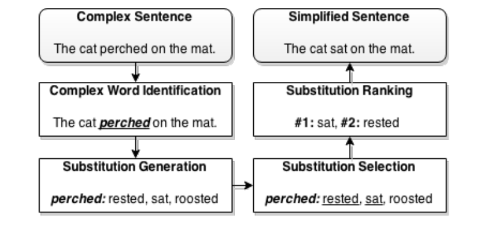

# Lexical Simplification for Medical Domain

Project for 2019 scholarship granted by Friedrich Wingert Foundation.

## Download MeSH 

1) [MeSH Hiearachy](ftp://nlmpubs.nlm.nih.gov/online/mesh/2018/asciimesh/d2018.bin)

2) [MeSH Trees](ftp://nlmpubs.nlm.nih.gov/online/mesh/2018/meshtrees/mtrees2018.bin)

## Lexical Simplifier Pipeline

*Lexical Simplification System Pipeline. Picture taken from (Paetzold et al. 2015) [1]*

## Future Directions

1. Use scispacy NER to create multi word expression e.g. "Spinal and bulbar muscular atrophy"

2. Use scispacy AbbreviationDetector to expand abbreviations and reduce vocabulary

3. Learn a mapping between plain english word embeddings and the medical one, simalar to what they do in (Yao Zijun, et al. 2018) [2]

## Acknowledgements

This project was developed thanks to a scholarship granted by the [Friedrich Wingert Foundation](https://www.wingert-stiftung.de/)

## References

[1] Paetzold, Gustavo, and Lucia Specia. "Lexenstein: A framework for lexical simplification." Proceedings of ACL-IJCNLP 2015 System Demonstrations (2015): 85-90.

[2] Yao, Zijun, et al. "Dynamic word embeddings for evolving semantic discovery." Proceedings of the Eleventh ACM International Conference on Web Search and Data Mining. ACM, 2018.

